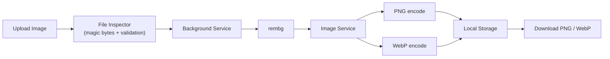
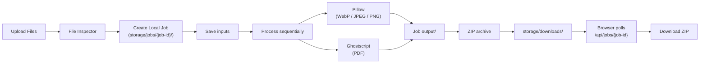

# Local Image & File Tools

A local-first, privacy-preserving desktop tool for **background removal** and **file compression**. Everything runs on your machine. No accounts, no cloud uploads, no external services.

---

## What it does

- **Remove backgrounds** from images and download transparent PNG / WebP results.
- **Compress files** (images + PDFs) with quality presets, target-size compression, and batch ZIP downloads.
- **Batch queue** for multiple files with real local progress tracking.
- **Secure upload pipeline** with magic-byte validation, size limits, and decompression-bomb protection.

---

## Architecture

```mermaid
flowchart TD
    subgraph Browser["Browser / Frontend"]
        UI["Static UI\n(HTML + CSS + JS)"]
    end

    subgraph FastAPI["FastAPI Backend"]
        Routes["Routes"]
        Controllers["Controllers"]
        Services["Services"]
        Repositories["Repositories"]
    end

    subgraph Infrastructure["Infrastructure"]
        Rembg["rembg"]
        Pillow["Pillow"]
        GS["Ghostscript"]
        Zip["ZIP Adapter"]
        Storage["Local Storage"]
        Jobs["Local Job System"]
    end

    UI -->|POST /api/background/remove| Routes
    UI -->|POST /api/compression/batch/start| Routes
    UI -->|GET /api/jobs/{job_id}| Routes
    UI -->|GET /api/compression/download/{file}| Routes

    Routes --> Controllers
    Controllers --> Services
    Services --> Repositories
    Services --> Infrastructure

    Repositories --> Storage
    Repositories --> Jobs

    Infrastructure --> Rembg
    Infrastructure --> Pillow
    Infrastructure --> GS
    Infrastructure --> Zip
```

### Data flow for background removal



### Data flow for compression



---

## Project structure

```text
app/
├── main.py                          # FastAPI app, static files, startup cleanup
├── core/
│   └── config.py                    # Central settings (paths, limits, env)
├── modules/
│   ├── background/                  # Background-removal feature
│   ├── compression/                 # Image + PDF compression feature
│   │   ├── image_compression/       # Pillow-based image compression
│   │   ├── pdf_compression/         # Ghostscript-based PDF compression
│   │   └── batch_compression_service.py
│   ├── archive/                     # ZIP creation service
│   ├── jobs/                        # Local job system (metadata + cleanup)
│   └── image/                       # Shared image schemas + processor
├── infrastructure/
│   ├── storage/                     # Local filesystem storage abstraction
│   ├── compression/                 # Pillow + Ghostscript adapters
│   ├── archive/                     # ZIP adapter
│   ├── image/                       # rembg adapter
│   └── jobs/                        # Local job storage (filesystem)
└── shared/
    ├── constants/                   # Supported formats, limits
    ├── enums/                       # File types, compression levels
    ├── types/                       # Shared typing helpers
    ├── utils/                       # Filename, size, formatting helpers
    └── file_inspection/             # Magic-byte validation, Pillow verification

frontend/
├── index.html
└── assets/
    ├── css/
    │   ├── reset.css
    │   ├── variables.css
    │   ├── base.css
    │   ├── components.css
    │   └── responsive.css
    └── js/
        ├── app.js
        ├── api.js
        ├── state.js
        ├── utils.js
        ├── background-remover.js
        └── compressor.js

storage/
├── uploads/         # Temporary uploads
├── processed/       # Background-removal results
├── compressed/      # Single-file compression results
├── jobs/            # Batch job folders + metadata.json
└── downloads/       # Public ZIP downloads
```

---

## Design principles

- **Local-only**: no database, no Redis, no cloud storage, no external APIs.
- **Stateless backend**: temporary job state lives in `storage/jobs/` as `metadata.json`.
- **Clean architecture**: controllers never call Pillow/Ghostscript directly; they go through services and adapters.
- **Secure by default**: magic-byte inspection, Pillow verification, `MAX_IMAGE_PIXELS`, size limits.
- **Progressive disclosure**: simple frontend flow, advanced settings available when needed.

---

## Prerequisites

- Python 3.10+
- Virtual environment tool (`python3 -m venv`)
- Ghostscript (for PDF compression)

### Linux (Debian / Ubuntu / Kali)

```bash
sudo apt update
sudo apt install python3-full python3-venv ghostscript
```

### macOS

```bash
brew install python ghostscript
```

### Windows

Install Python from python.org and Ghostscript from ghostscript.com.

---

## Setup

```bash
# 1. Clone or open the project
cd Lesser\&Remover

# 2. Create virtual environment
python3 -m venv .venv

# 3. Activate virtual environment
# Linux / macOS:
source .venv/bin/activate
# Windows:
# .venv\Scripts\activate

# 4. Upgrade pip
python -m pip install --upgrade pip

# 5. Install dependencies
python -m pip install -r requirements.txt

# 6. Verify Ghostscript
gs --version
```

---

## Run

```bash
uvicorn app.main:app --reload
```

Then open:

- **Frontend**: http://127.0.0.1:8000
- **API docs (Swagger)**: http://127.0.0.1:8000/docs
- **Health check**: http://127.0.0.1:8000/health

---

## How to use

### Background remover

1. Open http://127.0.0.1:8000
2. Switch to **Remove background**
3. Drag & drop an image or click **Choose image**
4. Wait for processing
5. Download PNG or WebP

### Compressor (single file)

1. Switch to **Compress files**
2. Drag & drop an image or PDF
3. Choose quality preset or output format
4. Click **Compress files**
5. Download the result

### Compressor (batch)

1. Drag & drop multiple files (images + PDFs)
2. Adjust settings
3. Click **Compress files**
4. Watch real-time progress
5. Download a ZIP containing all compressed files

---

## API overview

| Method | Path | Purpose |
|--------|------|---------|
| GET | `/` | Frontend |
| GET | `/health` | Health check |
| GET | `/docs` | Swagger UI |
| GET | `/static/...` | Static assets |
| POST | `/api/background/remove` | Remove background |
| GET | `/api/background/download/{filename}` | Download transparent result |
| POST | `/api/compression` | Compress single file |
| POST | `/api/compression/batch/start` | Start batch compression |
| GET | `/api/jobs/{job_id}` | Poll batch job status |
| GET | `/api/compression/download/{filename}` | Download compressed file or ZIP |

---

## Environment variables

Create a `.env` file at the project root:

```bash
APP_NAME=Local Image & File Tools
APP_VERSION=1.0.0
APP_ENV=development
DEBUG=true
HOST=127.0.0.1
PORT=8000
MAX_UPLOAD_SIZE_MB=100
UPLOAD_DIRECTORY=storage/uploads
PROCESSED_DIRECTORY=storage/processed
COMPRESSED_DIRECTORY=storage/compressed
TEMP_DIRECTORY=storage/temp
JOB_DIRECTORY=storage/jobs
DOWNLOAD_DIRECTORY=storage/downloads
JOB_EXPIRATION_MINUTES=30
```

---

## Storage layout

```text
storage/
├── uploads/          # Raw uploads (temporary)
├── processed/        # Background-removal outputs
├── compressed/       # Single-file compression outputs
├── temp/             # Generic temp files
├── jobs/             # Batch job folders
│   └── {job-id}/
│       ├── metadata.json
│       ├── input/
│       └── output/
└── downloads/        # Public ZIP downloads
```

---

## Security notes

- File type is determined by **magic bytes**, not by filename or browser-provided MIME type.
- Images are validated with Pillow (`verify()` + `load()`).
- `Image.MAX_IMAGE_PIXELS = 50_000_000` protects against decompression bombs.
- Upload size limits: images 25 MB, PDFs 50 MB.
- Filenames are sanitized before storage.

---

## Troubleshooting

**`gs --version` not found**
Install Ghostscript using the commands in Prerequisites.

**`ModuleNotFoundError`**
Make sure the virtual environment is activated and dependencies are installed.

**Port already in use**
Stop the other process or run on a different port:
```bash
uvicorn app.main:app --reload --port 8001
```

---

## License

Private / Local use. No cloud services involved.
