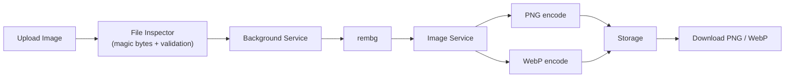
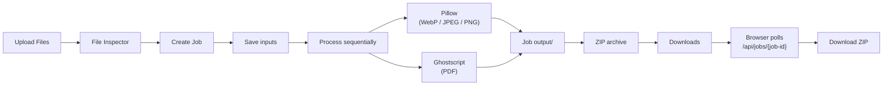

# Utils Tools

A fast, calm, and precise file utility for **background removal** and **file compression**. Runs entirely in your browser or on our server. No accounts, no cloud uploads, no external services required.

---

## What it does

- **Remove backgrounds** from images and download transparent PNG / WebP results.
- **Compress files** (images + PDFs) with quality presets, target-size compression, and batch ZIP downloads.
- **Batch queue** for multiple files with real progress tracking.
- **Secure upload pipeline** with magic-byte validation, size limits, and decompression-bomb protection.

---

## Architecture

```mermaid
flowchart TD
    subgraph Browser["Browser / Frontend"]
        UI["Static UI\n(HTML + CSS + JS)"]
    end

    subgraph FastAPI["FastAPI Backend"]
        Routes["Routes"]
        Controllers["Controllers"]
        Services["Services"]
        Repositories["Repositories"]
    end

    subgraph Infrastructure["Infrastructure"]
        Rembg["rembg"]
        Pillow["Pillow"]
        GS["Ghostscript"]
        Zip["ZIP Adapter"]
        Storage["Storage Abstraction"]
        Jobs["Job System"]
    end

    UI -->|POST /api/background/start| Routes
    UI -->|POST /api/compression/batch/start| Routes
    UI -->|GET /api/jobs/{job_id}| Routes
    UI -->|GET /api/compression/download/{filename}| Routes

    Routes --> Controllers
    Controllers --> Services
    Services --> Repositories
    Services --> Infrastructure

    Repositories --> Storage
    Repositories --> Jobs

    Infrastructure --> Rembg
    Infrastructure --> Pillow
    Infrastructure --> GS
    Infrastructure --> Zip

    Storage -->|local| LocalFS["./storage/"]
    Storage -->|vercel| VercelBlob["Vercel Blob"]
```

### Data flow for background removal



### Data flow for compression



---

## Deployment modes

This repository supports two deployment targets with the same codebase.

### Local mode

```bash
# 1. Clone or open the project
cd Utils-tool

# 2. Create virtual environment
python3 -m venv .venv

# 3. Activate virtual environment
source .venv/bin/activate  # Linux / macOS
# .venv\Scripts\activate   # Windows

# 4. Upgrade pip
python -m pip install --upgrade pip

# 5. Install dependencies
python -m pip install -r requirements.txt

# 6. Verify Ghostscript
gs --version

# 7. Run
./start.sh
```

Then open http://127.0.0.1:8000

### Vercel mode

1. Connect your GitHub repository to Vercel
2. Set the project root to the repository root
3. Add environment variables in Vercel:
   - `STORAGE_DRIVER=vercel`
   - `BLOB_READ_WRITE_TOKEN=<your-vercel-blob-token>`
   - `CORS_ORIGINS=https://your-domain.vercel.app`
4. Connect Vercel Blob to your project
5. Deploy

Both modes use the same repository, same routes, and same frontend.

---

## Project structure

```text
app/
├── main.py                          # FastAPI app, static files, startup cleanup
├── core/
│   ├── config.py                    # Central settings (paths, limits, env)
│   ├── logging.py                   # Structured logging
│   └── exceptions.py                # Exception handlers
├── modules/
│   ├── background/                  # Background-removal feature
│   ├── compression/                 # Image + PDF compression feature
│   │   ├── image_compression/       # Pillow-based image compression
│   │   ├── pdf_compression/         # Ghostscript-based PDF compression
│   │   └── batch_compression_service.py
│   ├── archive/                     # ZIP creation service
│   ├── jobs/                        # Job system (metadata + cleanup)
│   └── image/                       # Shared image schemas + processor
├── infrastructure/
│   ├── storage/                     # Storage abstraction (local + Vercel)
│   ├── compression/                 # Pillow + Ghostscript adapters
│   ├── archive/                     # ZIP adapter
│   ├── image/                       # rembg adapter
│   └── jobs/                        # Job storage (local + Vercel)
└── shared/
    ├── constants/                   # Supported formats, limits
    ├── enums/                       # File types, compression levels
    ├── types/                       # Shared typing helpers
    ├── utils/                       # Filename, size, formatting helpers
    └── file_inspection/             # Magic-byte validation, Pillow verification

frontend/
├── index.html
└── assets/
    ├── css/
    │   ├── reset.css
    │   ├── variables.css
    │   ├── base.css
    │   ├── components.css
    │   └── responsive.css
    └── js/
        ├── app.js
        ├── api.js
        ├── utils.js
        ├── error-boundary.js
        ├── background-remover.js
        ├── compressor.js
        └── support-popup.js

api/
└── index.py                         # Vercel serverless entry point

storage/
├── uploads/         # Temporary uploads (local only)
├── processed/       # Background-removal results (local only)
├── compressed/      # Single-file compression results (local only)
├── temp/            # Generic temp files (local only)
├── jobs/            # Batch job folders + metadata.json (local only)
└── downloads/       # Public ZIP downloads (local only)
```

---

## Design principles

- **Local-first**: no database, no Redis, no cloud storage, no external APIs.
- **Stateless backend**: temporary job state lives in storage as `metadata.json`.
- **Clean architecture**: controllers never call Pillow/Ghostscript directly; they go through services and adapters.
- **Secure by default**: magic-byte inspection, Pillow verification, `MAX_IMAGE_PIXELS`, size limits.
- **Progressive disclosure**: simple frontend flow, advanced settings available when needed.

---

## Prerequisites

- Python 3.10+
- Virtual environment tool (`python3 -m venv`)
- Ghostscript (for PDF compression)

### Linux (Debian / Ubuntu / Kali)

```bash
sudo apt update
sudo apt install python3-full python3-venv ghostscript
```

### macOS

```bash
brew install python ghostscript
```

### Windows

Install Python from python.org and Ghostscript from ghostscript.com.

---

## Environment variables

Create a `.env` file at the project root:

```bash
APP_NAME=Utils Tools
APP_VERSION=1.0.0
APP_ENV=development
DEBUG=true
HOST=127.0.0.1
PORT=8000
MAX_UPLOAD_SIZE_MB=100

STORAGE_DRIVER=local

UPLOAD_DIRECTORY=storage/uploads
PROCESSED_DIRECTORY=storage/processed
COMPRESSED_DIRECTORY=storage/compressed
TEMP_DIRECTORY=storage/temp

JOB_TTL_MINUTES=30

CORS_ORIGINS=http://127.0.0.1:8000,http://localhost:8000

# Vercel only
BLOB_READ_WRITE_TOKEN=
```

---

## Storage layout (local mode)

```text
storage/
├── uploads/          # Raw uploads (temporary)
├── processed/        # Background-removal outputs
├── compressed/       # Single-file compression outputs
├── temp/             # Generic temp files
├── jobs/             # Batch job folders
│   └── {job-id}/
│       ├── metadata.json
│       ├── input/
│       └── output/
└── downloads/        # Public ZIP downloads
```

---

## Logs (local mode)

Logs are written to `logs/` and split into separate files so each area can be
audited independently:

```text
logs/
├── system.log              # App core, infrastructure, storage, uvicorn
├── activities.log          # Job lifecycle (create, status, cancel, cleanup)
├── background_remover.log  # Background-removal requests and results
└── compression.log         # Compression jobs and per-file results
```

Every log line records the timestamp, level, logger name, and the source
function/line. In production (Vercel) file logging is disabled and all
categories stream to stdout, which Vercel surfaces in the dashboard.

---

## Security notes

- File type is determined by **magic bytes**, not by filename or browser-provided MIME type.
- Images are validated with Pillow (`verify()` + `load()`).
- `Image.MAX_IMAGE_PIXELS = 50_000_000` protects against decompression bombs.
- Upload size limits: images 25 MB, PDFs 50 MB.
- Filenames are sanitized before storage.
- Vercel Blob token is never exposed to the frontend.

---

## Troubleshooting

**`gs --version` not found**
Install Ghostscript using the commands in Prerequisites.

**`ModuleNotFoundError`**
Make sure the virtual environment is activated and dependencies are installed.

**Port already in use**
Stop the other process or run on a different port:
```bash
uvicorn app.main:app --reload --port 8001
```

---

## License

Private / Local use. No cloud services involved.
