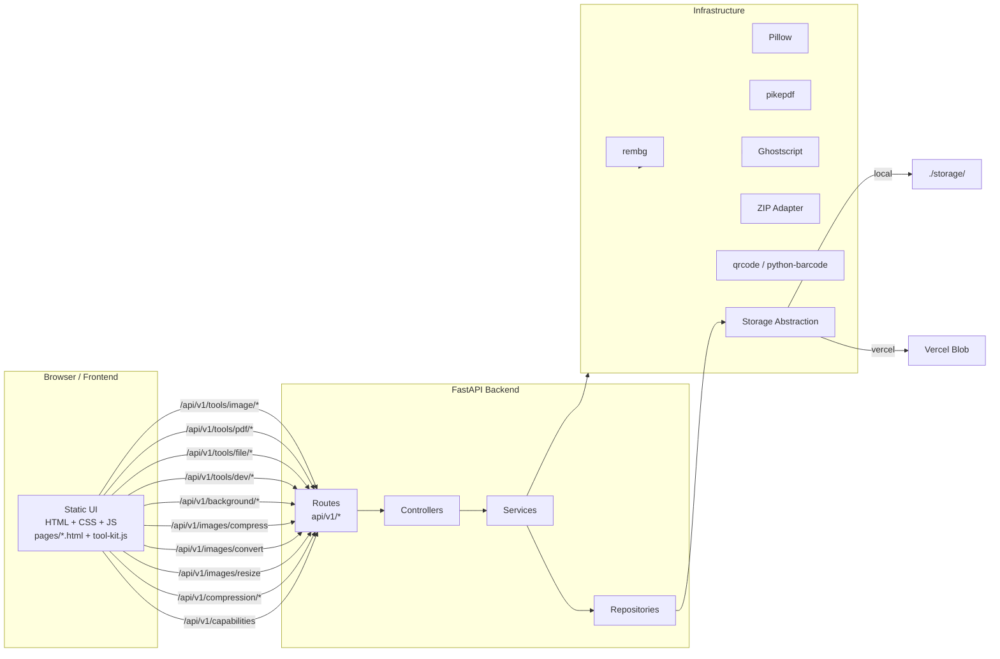
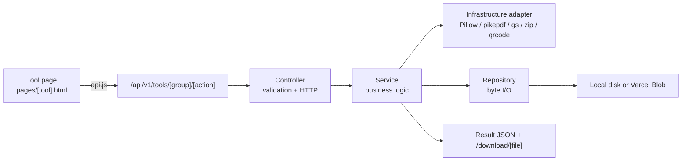

# Utils-tool

A local-first file and media utility suite: **29 tools** for images, PDFs,
files, developer assets and everyday utilities. Includes the new Image
Resizer, enhanced batch Image Converter, Image Cropper, and SVG Generator
(image-to-SVG). One codebase runs locally with full features, or on Vercel
as a serverless app. No database, no Redis, no accounts, no cloud uploads.

## What it does

- **Image tools** — image compressor (quality slider, target-size, metadata removal, JPG/PNG/WebP), background remover, converter (AVIF/JPG/PNG/WebP, batch), resizer (aspect/exact/percent/max, presets, quality, transparency), **cropper** (rotate, flip, aspect ratios, precision crop), editor, metadata remover, watermark, background replacement
- **PDF tools** — compressor, merger, splitter, rotator, page extractor, PDF→image, image→PDF
- **File tools** — analyzer (type/size/hash/dimensions), ZIP creator, duplicate finder
- **Developer tools** — favicon generator, SVG optimizer, **SVG generator** (image-to-SVG), image↔Base64, QR code generator, barcode generator
- **Utility tools** — social media resizer (platform presets), screenshot beautifier
- **Batch queue** for multi-file tools with real progress tracking
- **Secure upload pipeline** with magic-byte validation, size limits, and decompression-bomb protection
- **Capability system** — every tool declares its runtime needs; the frontend shows, hides or disables tools automatically per environment

---

## Architecture



Every tool follows the same layered flow:



## Project structure

```text
app/
├── main.py                          # FastAPI app, routers, static files, startup
├── api/
│   └── __init__.py                  # API_PREFIX = /api/v1, route registration
├── core/
│   ├── config.py                    # Central settings (paths, limits, env)
│   ├── capabilities.py              # 27-tool capability registry (env gating)
│   ├── logging.py                   # Structured logging
│   ├── exceptions.py                # Unified error format + handlers
│   └── middleware.py                # Request ID + CORS
├── modules/
│   ├── background/                  # Background removal + replacement
│   ├── compression/                 # Image + PDF compression
│   ├── image/                       # Converter, resizer, cropper, metadata, watermark
│   ├── pdf/                         # Merge, split, rotate, extract, PDF<->image
│   ├── file_tools/                  # Analyzer, ZIP, duplicate finder
│   ├── devtools/                    # Favicon, SVG optimizer, SVG generator, QR, barcode
│   └── jobs/                        # Job system (metadata + cleanup)
├── infrastructure/
│   ├── storage/                     # Storage abstraction (local + Vercel Blob)
│   ├── compression/                 # Pillow + Ghostscript adapters
│   ├── archive/                     # ZIP adapter
│   ├── image/                       # rembg adapter
│   └── jobs/                        # Job storage (local + Vercel)
└── shared/
    ├── constants/                   # Formats, limits, social presets
    ├── utils/                       # Filename, size, formatting helpers
    └── file_inspection/             # Magic-byte validation, Pillow verification

frontend/
├── index.html                       # Capability-driven landing grid
├── pages/                           # 27 tool pages (one HTML + one JS per tool)
└── assets/
    ├── css/                         # reset / variables / base / components / responsive
    └── js/
        ├── api.js                   # apiGet / apiUpload / apiDownload
        ├── pages/tool-kit.js        # Shared tool page bootstrap (capability gating)
        ├── pages/{tool}.js          # Per-tool page logic
        └── ...

api/
├── index.py                         # Vercel serverless entry point (Mangum)
└── requirements.txt                 # Lightweight deps for Vercel (excludes rembg)

storage/                             # Local mode only
├── uploads/         # Temporary uploads
├── processed/       # Background-removal results
├── compressed/      # Compression results
├── temp/            # Generic temp files
├── jobs/            # Batch job folders + metadata.json
└── downloads/       # Public ZIP downloads
```

---

## Design principles

- **Local-first**: no database, no Redis, no cloud storage, no external APIs required for local use.
- **Stateless backend**: temporary job state lives in storage as `metadata.json`.
- **Clean architecture**: controllers never call Pillow/Ghostscript/pikepdf directly; they go through services and adapters.
- **Capability-driven UI**: the `/api/v1/capabilities` endpoint tells the frontend which tools are available in the current environment (e.g. Ghostscript tools are local-only); pages adapt automatically.
- **Secure by default**: magic-byte inspection, Pillow verification, `MAX_IMAGE_PIXELS`, size limits, sanitized filenames.
- **Progressive disclosure**: simple default flow, advanced settings available when needed.

## Testing

```bash
source .venv/bin/activate
python -m pytest tests/ -q        # 230 tests: units, API contracts, capability gating
```

Covers the unified error format, all 29 tools' services, the capability registry
(including Vercel gating), and every frontend page + page script serving correctly.

## Environment variables

Create a `.env` file at the project root (see `.env.example`):

---

## Prerequisites

- Python 3.10+
- Virtual environment tool (`python3 -m venv`)
- Ghostscript (for PDF compression)

### Linux (Debian / Ubuntu / Kali)

```bash
sudo apt update
sudo apt install python3-full python3-venv ghostscript
```

### macOS

```bash
brew install python ghostscript
```

### Windows

Install Python from python.org and Ghostscript from ghostscript.com.

---

## Environment variables

Create a `.env` file at the project root:

```bash
APP_NAME=Utils-tool
APP_VERSION=1.0.0
APP_ENV=development
DEBUG=true
HOST=127.0.0.1
PORT=8000
MAX_UPLOAD_SIZE_MB=100

STORAGE_DRIVER=local

UPLOAD_DIRECTORY=storage/uploads
PROCESSED_DIRECTORY=storage/processed
COMPRESSED_DIRECTORY=storage/compressed
TEMP_DIRECTORY=storage/temp

JOB_TTL_MINUTES=30

CORS_ORIGINS=http://127.0.0.1:8000,http://localhost:8000

# Vercel only
BLOB_READ_WRITE_TOKEN=
```

---

## Deployment

One codebase, two targets — see [DEPLOYMENT.md](DEPLOYMENT.md) for full details.

### Local mode

```bash
python3 -m venv .venv && source .venv/bin/activate
python -m pip install -r requirements.txt
gs --version          # required for PDF compression / PDF->image
./start.sh            # serves http://127.0.0.1:8000
```

### Vercel mode

Set `STORAGE_DRIVER=vercel` and `BLOB_READ_WRITE_TOKEN=<token>` in Vercel,
connect Vercel Blob, and deploy. The capability system automatically restricts
Ghostscript-based tools (PDF compression, PDF→image) to local runs.

---

## Storage layout (local mode)

```text
storage/
├── uploads/          # Raw uploads (temporary)
├── processed/        # Background-removal outputs
├── compressed/       # Single-file compression outputs
├── temp/             # Generic temp files
├── jobs/             # Batch job folders
│   └── {job-id}/
│       ├── metadata.json
│       ├── input/
│       └── output/
└── downloads/        # Public ZIP downloads
```

---

## Logs (local mode)

Logs are written to `logs/` and split into separate files so each area can be
audited independently:

```text
logs/
├── system.log              # App core, infrastructure, storage, uvicorn
├── activities.log          # Job lifecycle (create, status, cancel, cleanup)
├── background_remover.log  # Background-removal requests and results
└── compression.log         # Compression jobs and per-file results
```

Every log line records the timestamp, level, logger name, and the source
function/line. In production (Vercel) file logging is disabled and all
categories stream to stdout, which Vercel surfaces in the dashboard.

---

## Security notes

- File type is determined by **magic bytes**, not by filename or browser-provided MIME type.
- Images are validated with Pillow (`verify()` + `load()`).
- `Image.MAX_IMAGE_PIXELS = 50_000_000` protects against decompression bombs.
- Upload size limits: images 25 MB, PDFs 50 MB.
- Filenames are sanitized before storage.
- Vercel Blob token is never exposed to the frontend.

---

## Troubleshooting

**`gs --version` not found**
Install Ghostscript using the commands in Prerequisites.

**`ModuleNotFoundError`**
Make sure the virtual environment is activated and dependencies are installed.

**Port already in use**
Stop the other process or run on a different port:
```bash
uvicorn app.main:app --reload --port 8001
```

---

## License

This project is open-source software licensed under the
[MIT License](./LICENSE).  You are free to use, modify, and distribute it
commercially or privately.  See [CONTRIBUTING.md](./CONTRIBUTING.md) for
how to submit bug reports, feature requests, and pull requests.

> All processing runs locally in the browser or on your own server — no cloud
> uploads, no accounts, no tracking.
